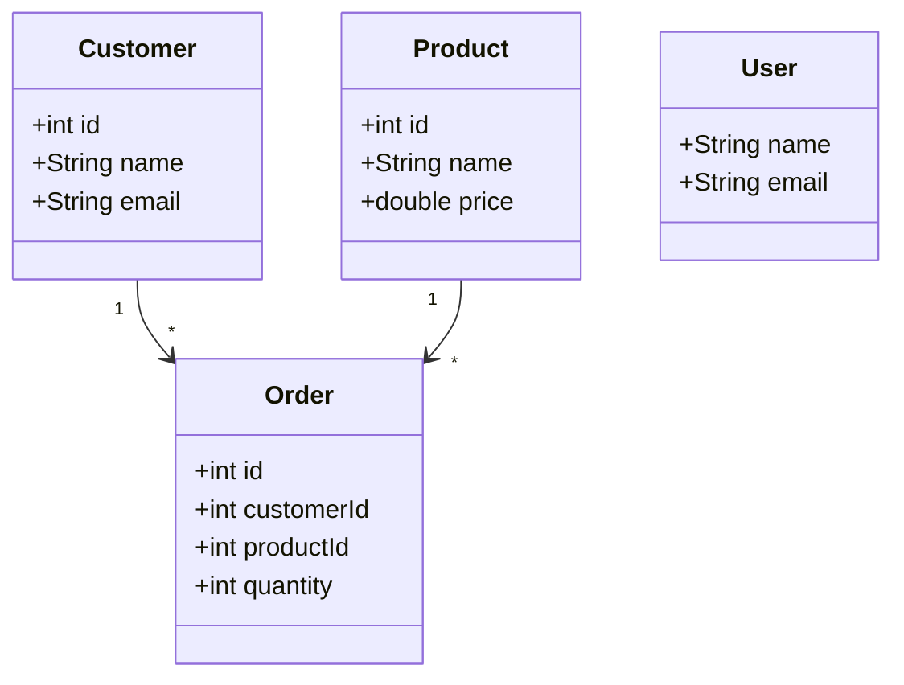
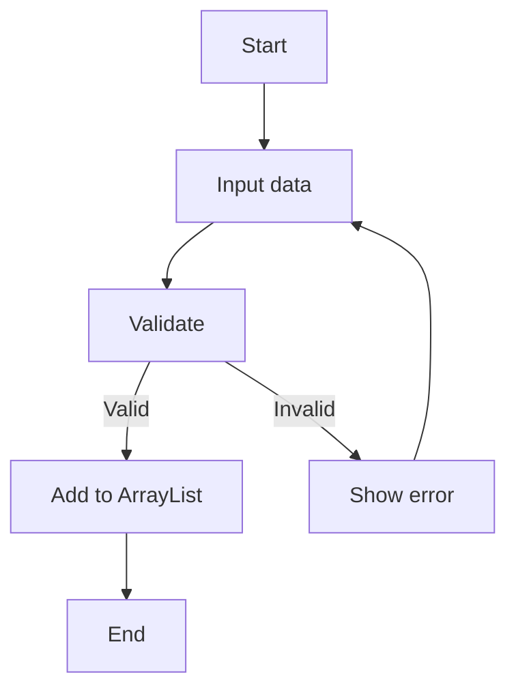
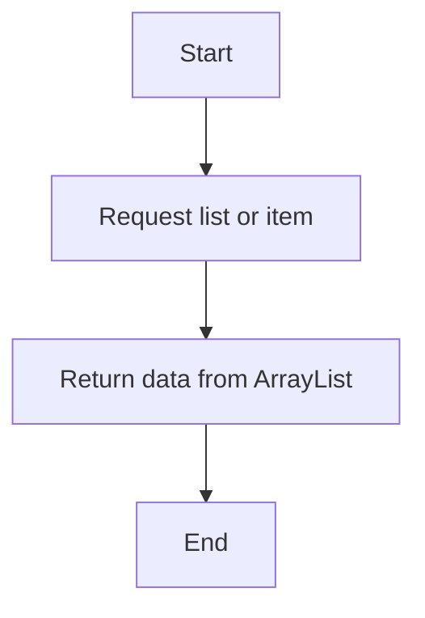
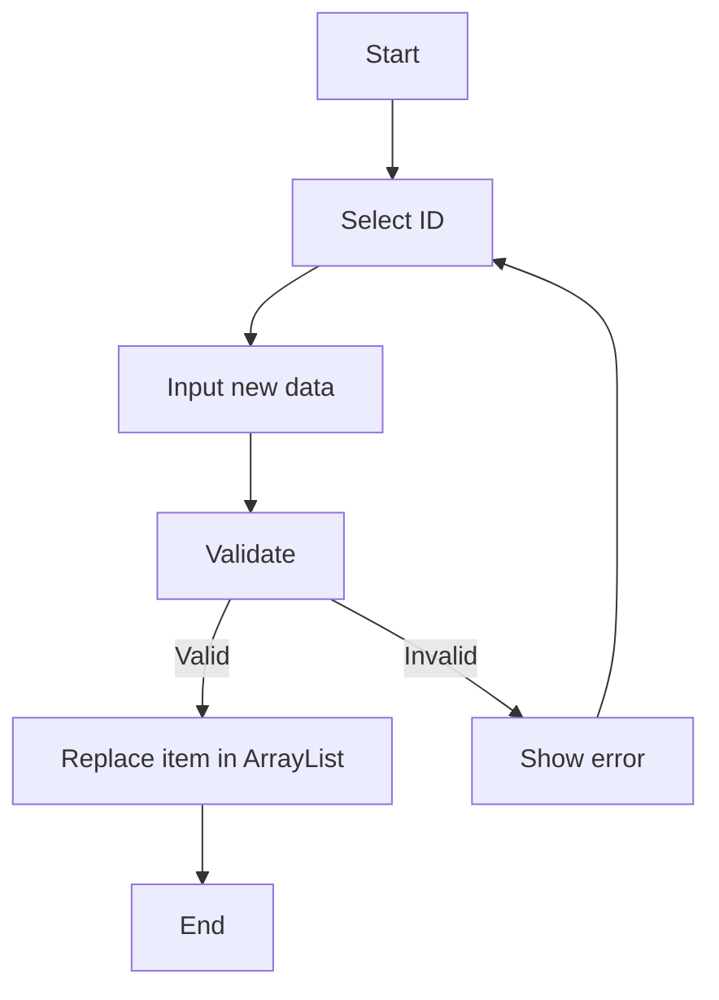
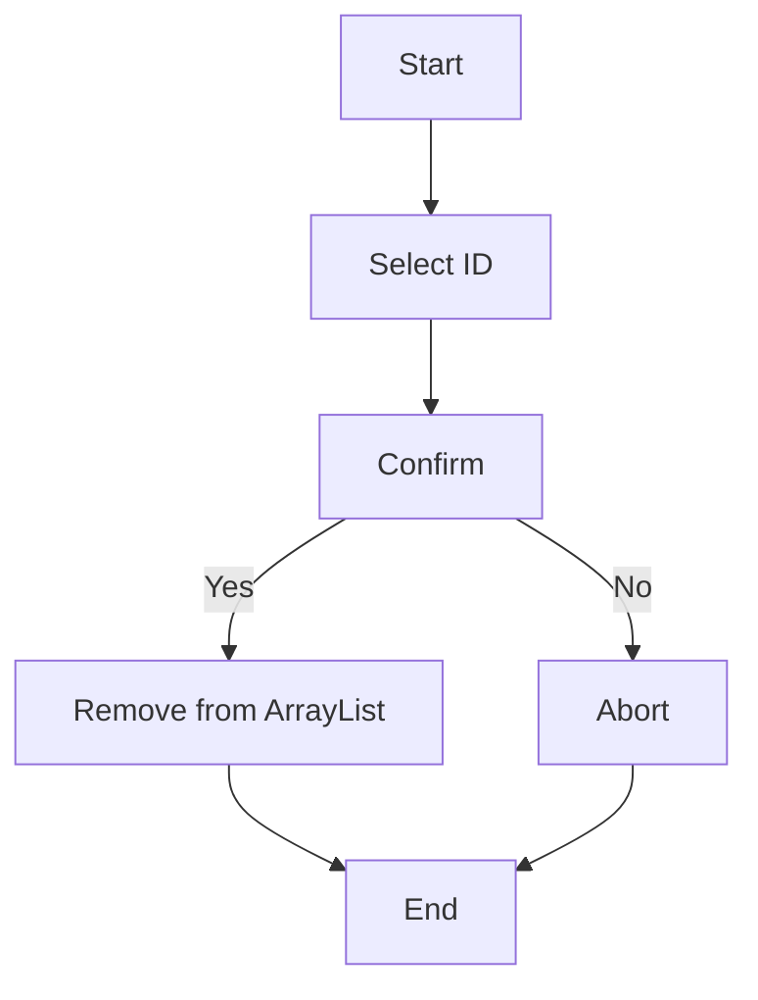

# OOP_N04_25_26_TriDung_DucManh_VanThang

Demo Spring Boot project (ArrayList storage) for Product, Customer, Order, User.
Includes REST API and Thymeleaf UI.

## Run
- Open in IDE and run `DemoApplication.java` or: `mvn spring-boot:run`
- Web UI: http://localhost:8080/
- APIs: /api/products, /api/customers, /api/orders, /api/users

## Class Diagram (Mermaid)

## Activity diagrams (Mermaid)

### Create

### Read

### Update

### Delete

## Notes
- Data is stored in-memory. Restarting the app resets data.
- You can extend DAOs to use JPA/H2 or MySQL later.